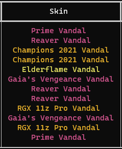
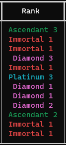
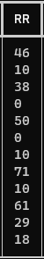
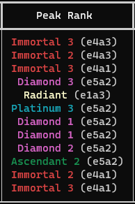
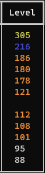

<p align="center">
    <a href="https://github.com/MaitreAntho/Valinfo-remake">
        
    </a>
<h5 align="center">Valinfo</h5>

<p align="center">
  🇬🇧 English (this file) · 🇫🇷 <a href="README.fr.md">Français</a>
</p>

> This is a **community-maintained continuation** of [McDaived/Valinfo](https://github.com/McDaived/Valinfo), which has been unmaintained for about 3 years. See [Credits](#credits) below.

##  Features :
|Their Queue|Current Skin|Current Rank|Rank Rating|Peak Rank|Account Level|
|:---:|:---:|:---:|:---:|:---:|:---:|
|||||||

- English / French interface, switchable anytime from the configurator
- Live round score, party detection, "already played with" recent-encounter alerts
- Discord Rich Presence
- Fixed for the current Valorant client and Python 3.10+ (including 3.13/3.14)

##  About :
To know what this is, visit the original project's page: [Valinfo](https://mcdaived.github.io/Valinfo)

##  Usage :

1) Install [Python 3.10 or newer](https://www.python.org/downloads/), make sure it's added to your PATH.
2) Download the source code:
   ```
   https://github.com/MaitreAntho/Valinfo-remake/archive/refs/heads/main.zip
   ```
   or clone it with git:
   ```
   git clone https://github.com/MaitreAntho/Valinfo-remake.git
   ```
3) Double-click **`launch.bat`** to install dependencies and start Valinfo.

That's it — `launch.bat` installs everything it needs on first run.

### Other .bat scripts

| Script | What it does |
|---|---|
| `launch.bat` | Installs dependencies (if needed) and runs Valinfo |
| `config.bat` | Opens the interactive configurator (language, weapon, table columns, port, feature flags...) |
| `update.bat` | Pulls the latest version from git and updates dependencies |

> `-` You can also change settings directly by editing `config.json`. If something breaks after a manual edit, just delete `config.json` and Valinfo will re-prompt you (or run `config.bat`).

##  What is that :

 - [Valorant-API.com](https://valorant-api.com/)

`This tool uses the local Valorant client API — it is not ban-able as it never touches the game's memory or files.`

This Project is not associated or endorsed by RIOT GAMES. Riot Games, and all associated properties are trademarks or registered trademarks of Riot Games, Inc.
Whilst effort has been made to abide by Riot's API rules; you acknowledge that use of this software is done so at your own risk.

## Credits

Valinfo was originally created by **[McDaived](https://github.com/McDaived)** — all credit for the original concept, design, and years of work goes to them.
Their project has been unmaintained since 2023; this repository is an independent continuation that keeps it working with the current Valorant client and adds new features (language switching, live round score, bug fixes for the current Riot API, etc.), while keeping the original spirit of the tool.

If you're looking for the original, unmaintained project, it's here: [McDaived/Valinfo](https://github.com/McDaived/Valinfo).
